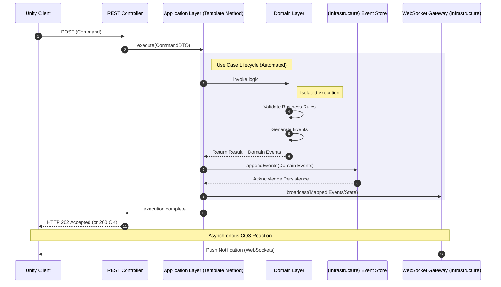

# Architecture Proof of Concept: Multiplayer Card Game

## Overview
This repository serves as an architectural sandbox (Proof of Concept) for evaluating design patterns and system design approaches. The project implements a multiplayer card game backend, focusing on an event-driven model and state management via Event Sourcing.

## System Architecture
The system utilizes an adapted Hexagonal Architecture (Ports and Adapters) with strict domain isolation:

* **Domain Layer:** Fully isolated from external dependencies. Contains the core card game rules. Generates Domain Events during business scenario execution without direct I/O access.
* **Application Layer:** Acts as an orchestrator. Accumulates events generated by the domain until the use case completes. Upon successful execution, it persists events via the infrastructure layer and broadcasts data changes to clients.
* **Infrastructure Layer:** Handles persistence (Event Store) and network communication (REST/WebSockets).

## Communication Flow (Asynchronous CQS)
The system decouples command and reaction channels:
* **Commands:** The client (Unity) sends intents (player actions) via synchronous REST requests.
* **Reactions:** The backend broadcasts updated state and event notifications asynchronously via WebSockets.

## Key Design Decisions
* **Event Sourcing:** Implemented to guarantee an immutable state mutation log. This resolves specific business requirements such as "Undo Move" and full game "Replays," while providing a foundation for session auditing.
* **Template Method in Use Cases:** Standardized Application layer handlers using the Template Method pattern. A base class encapsulates the infrastructural lifecycle (transaction start, event collection, persistence, broadcasting). Extending classes only need to implement domain logic invocation and WebSocket DTO mapping, significantly reducing boilerplate.

## Tech Stack
* **Backend Core:** Node.js, TypeScript
* **Client:** C#, Unity
* **Containerization:** Docker, Docker Compose
* **Deployment:** Custom bash scripts.

## Trade-offs & Limitations
Conscious compromises made within the scope of this PoC:
* **Security:** Authentication, authorization, and rate-limiting mechanisms are intentionally omitted to maintain strict focus on core architectural patterns.
* **Concurrency Model:** Currently, concurrent request handling relies on a stateless model. Complex In-Memory state synchronization and distributed locking are deferred to the next architectural iteration.

# ADR: Why Event Sourcing?

I needed to figure out how to manage game state. Standard CRUD (just overwriting the current state in the DB) honestly doesn't cut it here. For a card game, features like "undo move", full match replays, and proper auditing (who played what) are critical. If we built this on top of CRUD, we'd have to hack together some heavy workarounds to track state diffs.

**Decision:**
Went with Event Sourcing. We don't store a snapshot of the current game. Instead, an Event Store logs all domain events that occur. The game state is rebuilt on the fly by replaying these events from the very beginning.

**What we got out of it (Pros):**
* **Replays and Undo out of the box:** State can be restored to any point in time simply by stopping the log read at the desired event.
* **Auditing:** We have a rock-solid history of all mutations. Useful for debugging and acts as a foundation for anti-cheat.
* **Architectural fit:** The domain only handles business logic and spits out events. This fits perfectly with our async CQS, where commands come in via REST and results are pushed to clients over WebSockets.

**Where we could shoot ourselves in the foot (Cons & Trade-offs):**
* **Complexity overhead:** Higher barrier to entry, more code to write than simple DB updates. Partially solved this with an abstraction in the App layer (a base class handles the boilerplate for saving and broadcasting).
* **Event versioning:** If we change the structure of old events, the DB will fall out of sync with the code, requiring migrations (upcasting). Ignored this for now; the schema is strictly additive.
* **Performance:** Replaying thousands of events for old or long games is expensive on CPU and memory. Once we hit the limits, we'll need to bolt on Snapshotting (saving an intermediate state every N moves).
