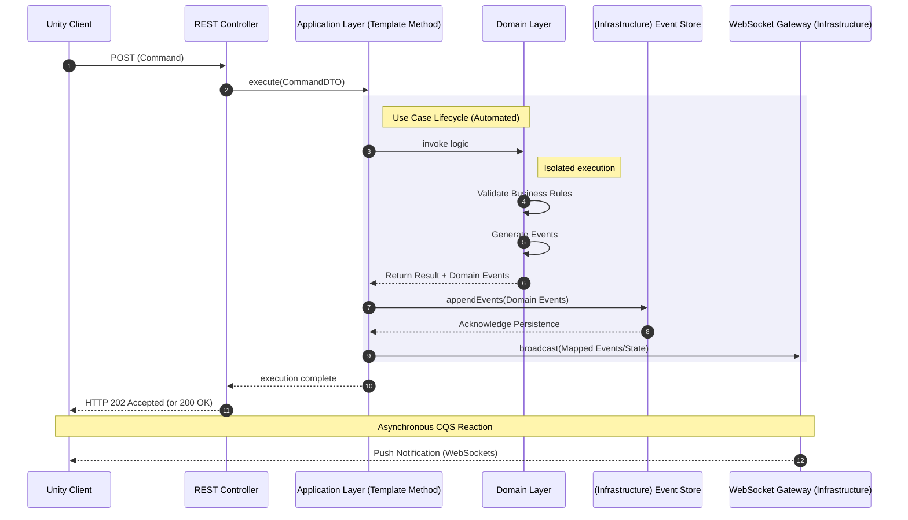

# Architecture Proof of Concept: Multiplayer Card Game

## Overview
This repository serves as an architectural sandbox (Proof of Concept) for evaluating design patterns and system design approaches. The project implements a multiplayer card game backend, focusing on an event-driven model and state management via Event Sourcing.

## System Architecture
The system utilizes an adapted Hexagonal Architecture (Ports and Adapters) with strict domain isolation:

* **Domain Layer:** Fully isolated from external dependencies. Contains the core card game rules. Generates Domain Events during business scenario execution without direct I/O access.
* **Application Layer:** Acts as an orchestrator. Accumulates events generated by the domain until the use case completes. Upon successful execution, it persists events via the infrastructure layer and broadcasts data changes to clients.
* **Infrastructure Layer:** Handles persistence (Event Store) and network communication (REST/WebSockets).

## Communication Flow (Asynchronous CQS)
The system decouples command and reaction channels:
* **Commands:** The client (Unity) sends intents (player actions) via synchronous REST requests.
* **Reactions:** The backend broadcasts updated state and event notifications asynchronously via WebSockets.

## Key Design Decisions
* **Event Sourcing:** Implemented to guarantee an immutable state mutation log. This resolves specific business requirements such as "Undo Move" and full game "Replays," while providing a foundation for session auditing.
* **Template Method in Use Cases:** Standardized Application layer handlers using the Template Method pattern. A base class encapsulates the infrastructural lifecycle (transaction start, event collection, persistence, broadcasting). Extending classes only need to implement domain logic invocation and WebSocket DTO mapping, significantly reducing boilerplate.

## Tech Stack
* **Backend Core:** Node.js, TypeScript
* **Client:** C#, Unity
* **Containerization:** Docker, Docker Compose
* **Deployment:** Custom bash scripts.

## Trade-offs & Limitations
Conscious compromises made within the scope of this PoC:
* **Security:** Authentication, authorization, and rate-limiting mechanisms are intentionally omitted to maintain strict focus on core architectural patterns.
* **Concurrency Model:** Currently, concurrent request handling relies on a stateless model. Complex In-Memory state synchronization and distributed locking are deferred to the next architectural iteration.
